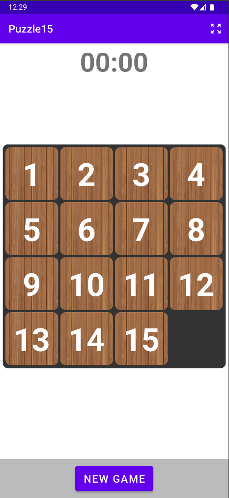
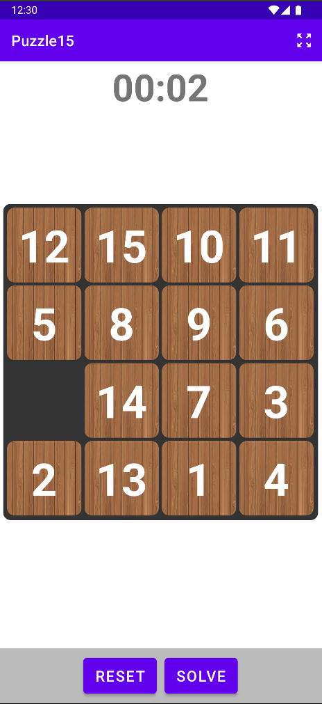
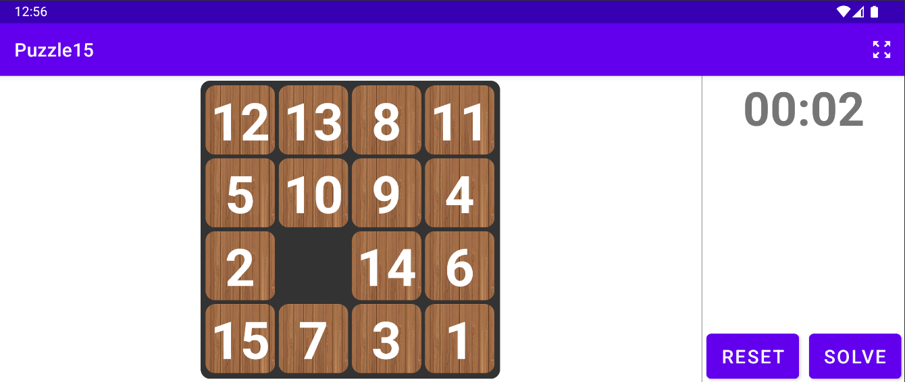

## Проект: Пятнашки

### Кратко:

1. Генерация уровня.
2. Решение головоломки вручную ([Видео](https://github.com/Mi-Kram/HseAndroid/tree/main/docs/media/manuallysolve.mkv)).
3. Сброс уровня.
4. Авто-сборка головоломки ([Видео](https://github.com/Mi-Kram/HseAndroid/tree/main/docs/media/autosolve.mkv)).
5. Вертикальный/горизонтальный режим.
6. Изменение размерности головоломки.
7. Изменение скорости сборки головоломки ([Видео](https://github.com/Mi-Kram/HseAndroid/tree/main/docs/media/resize_speed.mkv)).

 
